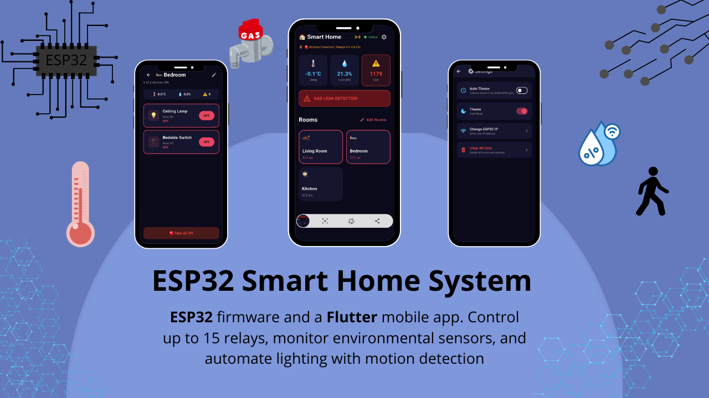

# IOT_project

---


##  Project Info

- **Course/Context:** iot project 
- **Institution:** usthb
- **Date:** 05 June 2025
- **Supervisor:** Dr HARKAT Yacine 

---

## done by 4th year students :

### BOUZIDI Sara
### BOUTAMINE Lina 
### RAMDANI Ilhem 
### AHMED SID Lina Douaa

# 🏠 ESP32 Smart Home System

A complete smart home automation solution built with **ESP32** firmware and a **Flutter** mobile app. Control up to 16 relays across multiple floors, monitor environmental sensors, automate lighting with motion detection, and sync everything across phones via the cloud — while keeping local control working even without internet.


## 🔭 Overview

This project creates a hybrid smart home controller using ESP32 microcontrollers paired with a cross-platform Flutter mobile application.

**Architecture:**
- **Local (no internet needed):** Relay control, sensor readings, WiFi setup, motion triggers
- **Cloud (Supabase):** Rooms, devices, users, motion config, and sensor room assignments sync live across all phones
- **Offline-first:** The app caches everything locally and auto-syncs when connection returns

The system supports **multiple ESP32 nodes**:
1. **Main Controller** — 16 relays, DHT11 temp/humidity, MQ gas sensor, PIR motion, buzzer, ESP-NOW receiver
2. **Sound Sensor Node** — KY-037 microphone via ESP-NOW to the main controller
3. **Remote Relay Node** — Additional relay on another floor (e.g., 2nd floor), controlled over WiFi


## 🎥 Demo Video

[](https://youtu.be/22qQ0Kw19CI)


---

##  Features

### 🔌 Device Control
- **15 relay channels** (K1-K15) individually controllable
- Room-based organization (Living Room, Bedroom, Kitchen, etc.)
- Device types: Lamps 💡, Switches 🔌, Outlets ⚡
- Bulk "Turn All Off" per room
- Real-time status polling (1-second refresh)
- Manual IP entry fallback when mDNS/auto-discovery fails

### 🌡️ Environmental Monitoring
- **DHT11** temperature & humidity sensor
- **MQ gas sensor** with configurable leak threshold
- **Buzzer alarm** triggers on dangerous gas levels
- Visual alerts in app (orange for high temp, red for gas leak)
- **Sensor Room Assignment** — assign each sensor to the room where it is physically located

### 🏃 Motion Detection
- **PIR sensor** for automatic motion-triggered lighting
- Per-relay selection — choose exactly which relays react to motion (not hardcoded)
- Config saved to Supabase and cached on ESP32 (works during internet outages)
- Toggle motion mode ON/OFF from app
- Visual motion status indicator with real-time detection feedback

### 👥 Multi-User & Admin
- **User registration & login** via Supabase (email/password)
- **Admin approval system** — new accounts require admin approval before access
- **Online/offline user tracking** — see who is currently using the app
- **Admin mode** — manage users, approve accounts, view all activity
- All users see who is online/offline; only admins can approve
  
### 🎨 App Features
- **Dark/Light theme** with automatic time-based switching (6AM-6PM light)
- **Slide-out navigation drawer** — clean access to Users, Settings, Logout
- **Live date & time** displayed on the dashboard
- **mDNS auto-discovery** — finds ESP32 without entering IP
- **Offline mode banner** — shows when cloud sync is paused, with one-tap sync retry
- **Customizable rooms & devices** — add, rename, delete(synced across all phones instantly)
- **Connection status** indicator for both main ESP32 and remote relay
- **Auto theme** — follows phone time, or manual override

### 📡 ESP-NOW Wireless Sensor
- Second ESP32 with KY-037 sound sensor sends data wirelessly to the main controller
- No WiFi connection needed between the two ESP32s
- Sound data appears in the app alongside temp/humidity/gas
  
---

## 🔧 Hardware Components

### Main Controller (ESP32 #1)

| Component | Purpose | Pin |
|-----------|---------|-----|
| ESP32 DevKit | Main microcontroller | — |
| DHT11 | Temperature & humidity | GPIO 4 |
| MQ-2/MQ-5 Gas Sensor | Gas leak detection | GPIO 34 (ADC) |
| HC-SR501 PIR | Motion detection | GPIO 35 |
| Active Buzzer | Gas alarm | GPIO 25 |
| 16-Channel Relay Module | Device switching | GPIO 13, 2, 14, 27, 26, 33, 32, 16, 23, 22, 21, 19, 18, 5, 17, 15|

### Sound Sensor Node (ESP32 #2)

| Component | Purpose | Pin |
|-----------|---------|-----|
| ESP32 DevKit | Sender microcontroller | — |
| KY-037 | Sound detection (analog + digital) | GPIO 34 (AO), GPIO 35 (DO) |

### Remote Relay Node (ESP32 #3)

| Component | Purpose | Pin |
|-----------|---------|-----|
| ESP32 DevKit | Remote relay controller | — |
| Relay Module | Upstairs/remote device switching | GPIO 13 |

### Relay Pin Mapping(Main Controller)
```
K1  → GPIO 13    K6  → GPIO 33    K11 → GPIO 21
K2  → GPIO 2     K7  → GPIO 32    K12 → GPIO 19
K3  → GPIO 14    K8  → GPIO 16    K13 → GPIO 18
K4  → GPIO 27    K9  → GPIO 23    K14 → GPIO 5
K5  → GPIO 26    K10 → GPIO 22    K15 → GPIO 17
```

---

## 🔌 Circuit Diagram

```
ESP32 DevKit V1
┌─────────────────┐
│ 3.3V ──┬────────┤
│        │        │
│ GPIO 4 ├───────►│ DHT11 (Temp/Hum)
│ GPIO 34├───────►│ MQ Gas Sensor (AO)
│ GPIO 35├───────►│ PIR Sensor (OUT)
│ GPIO 25├───────►│ Buzzer (+)
│        │        │
│ GPIO 13├───────►│ Relay K1
│ GPIO 2 ├───────►│ Relay K2
│ ...    │        │ ... (15 relays total)
│ GPIO 17├───────►│ Relay K15
│        │        │
│ 5V ────┼────────┤◄─── Relay Module VCC
│ GND ───┴────────┤◄─── Common GND
└─────────────────┘

Power Supply: 5V/2A minimum for relay module
              ESP32 via USB or 3.3V regulator
```
### Sound Sensor Node
```
ESP32 DevKit V1
┌─────────────────┐
│ 3.3V ──┬────────┤
│ GPIO 34├───────►│ KY-037 AO (Analog)
│ GPIO 35├───────►│ KY-037 DO (Digital)
│ GND ───┴────────┤◄─── KY-037 GND
│ 3.3V ───────────┤◄─── KY-037 VCC
└─────────────────┘
```
### Remote Relay Node
```
ESP32 DevKit V1
┌─────────────────┐
│ GPIO 13├───────►│ Relay IN
│ 5V ────┼────────┤◄─── Relay VCC
│ GND ───┴────────┤◄─── Relay GND
└─────────────────┘
```
---

## 🏗️ Software Architecture

```
┌─────────────────────────────────────────────────────────────┐
│                    FLUTTER MOBILE APP                       │
│  ┌─────────┐ ┌─────────┐ ┌──────────┐ ┌─────────────────┐   │
│  │Dashboard│ │ Settings│ │Edit Rooms│ │ 2nd Floor Relay │   │
│  └────┬────┘ └────┬────┘ └────┬─────┘ └────────┬────────┘   │
│       └─────────────┴───────────┴────────────────┘            │
│                    Services Layer                            │
│  ┌──────────┐ ┌──────────┐ ┌──────────┐ ┌──────────────┐    │
│  │EspService│ │RoomService│ │AuthService│ │Relay2Service │    │
│  │(HTTP)    │ │(Supabase) │ │(Supabase) │ │(HTTP)        │    │
│  └────┬─────┘ └────┬─────┘ └────┬─────┘ └──────┬───────┘    │
│       │            │            │                │            │
│       └────────────┴────────────┘                │            │
│              SharedPreferences                   │            │
│         (Offline cache & queue)                  │            │
└──────────────────┬─────────────────────────────┬────────────┘
                     │                             │
        ┌────────────┘                             │
        │ HTTP (WiFi LAN)                          │ HTTP (WiFi LAN)
┌───────▼────────────────┐              ┌───────────▼────────────┐
│   MAIN ESP32           │              │   REMOTE ESP32       │
│  ┌─────────┐ ┌────────┐ │              │  ┌──────────────┐    │
│  │WebServer│ │Sensors │ │              │  │ WebServer    │    │
│  │ (API)   │ │(DHT11) │ │              │  │ (1 relay)    │    │
│  └─────────┘ │ (MQ)   │ │              │  └──────────────┘    │
│              │ (PIR)  │ │              │                      │
│              └────────┘ │              │                      │
│  ┌─────────────────┐   │              │                      │
│  │  ESP-NOW Receiver│  │              │                      │
│  │  (Sound data)    │  │              │                      │
│  └─────────────────┘   │              │                      │
└────────────────────────┘              └──────────────────────┘
         ▲
         │ ESP-NOW (2.4 GHz, no WiFi needed)
┌────────┴────────────────┐
│   SOUND SENSOR ESP32    │
│  ┌─────────────────┐    │
│  │  KY-037 Sensor  │    │
│  │  (Analog/Digital)│    │
│  └─────────────────┘    │
└─────────────────────────┘
```


---

## 📡 API Reference

### Main ESP32

The ESP32 exposes a REST API on port 80:

### `GET /api/status`
Returns current sensor readings and relay states.

**Response:**
```json
{
  "t": 24.5,           // Temperature (°C)
  "h": 60.0,           // Humidity (%)
  "g": 800,            // Gas level (0-4095)
  "soundA": 342,
  "soundD": 0,
  "m": 1,              // Motion mode active (1/0)
  "p": 0,              // PIR current reading (1/0)
  "r": [1,1,0,0,0,0,0,0,0,0,0,0,0,0,0]  // Relay states (15)
}
```

### `GET /api/toggle?r=N`
Toggle relay N (0-14) ON/OFF.

**Response:** Same as `/api/status`

### `GET /api/alloff`
Turn all relays OFF.

**Response:** Same as `/api/status`

### `GET /api/motion`
Toggle motion detection mode ON/OFF.

**Response:**
```json
{"motion": 1}  // New motion mode state
```
#### `POST /api/wifi/config`
Save new WiFi credentials.

**Body:** `ssid=MyWiFi&pass=MyPassword`

**Response:**
```json
{"success": true}
```
### Remote Relay ESP32

#### `GET /api/status`
```json
{"r": [1]}
```

#### `GET /api/toggle?r=N`
Toggle relay N (0-based).

**Response:** Same as `/api/status`

#### `POST /api/wifi/config`
Same format as main ESP32.


---

## 🚀 Getting Started

### Prerequisites
- [Arduino IDE](https://www.arduino.cc/en/software) with ESP32 board support
- [Flutter SDK](https://flutter.dev/docs/get-started/install)
- Android Studio / VS Code with Flutter extension
- 3× ESP32 DevKit V1 (or 2× if skipping the remote relay)
- Hardware components listed above

### 1. Supabase Setup

1. Create a free project at [https://supabase.com](https://supabase.com)
2. Dashboard → SQL Editor → paste the contents of `supabase/schema.sql` → Run
3. Dashboard → Project Settings → API → copy the **"Project URL"** and **"anon public"** key
4. Paste both into `lib/supabase_config.dart`
5. Paste the SAME two values into `esp32/smart_home_esp32.ino` (`SUPABASE_URL` / `SUPABASE_ANON_KEY`)

### 2. Flutter Setup

Add to `pubspec.yaml` under `dependencies:` (keep existing ones too):
```yaml
  supabase_flutter: ^2.6.0
  http: ^1.2.0
  multicast_dns: ^0.3.2
  shared_preferences: ^2.2.0
```

Then:
```bash
flutter pub get
flutter run
```

### 3. ESP32 Setup

**Arduino Library Manager → Install:**
   -- ArduinoJson (by Benoit Blanchon)
   -  `DHT sensor library` by Adafruit
   - `ESPmDNS` (built-in with ESP32 core)

**Flash the 3 sketches:**

| Board | Sketch | Hotspot Name |
|-------|--------|--------------|
| Main Controller | `esp32/smart_home_esp32.ino` | `SmartHome-Setup` |
| Sound Sensor | `esp32/sound_sender.ino` | (none, ESP-NOW) |
| Remote Relay | `esp32/relay_floor2.ino` | `SmartHome-Relay2` |

**Board settings:**
- Board: "ESP32 Dev Module"
- Upload speed: 921600
- Flash frequency: 80MHz

### 4. First Run

1. **Power on the Main Controller.** It will create `SmartHome-Setup` hotspot.
2. **Connect your phone** to `SmartHome-Setup` (password `12345678`).
3. **Open the app** → WiFi Setup screen → enter your **home WiFi** name and password.
4. The ESP32 connects to your home WiFi. Its own hotspot **stays on** — you can always reconnect later from Settings to change WiFi.
5. **Register the first account** — it becomes admin automatically.
6. **Add rooms/devices** from "Edit Rooms" — relay numbers are enforced unique by the database.
7. Any other phone that registers needs the admin to tap **"Approve"** in the Users screen (side drawer → Users).


### 5. Remote Relay Setup

1. **Power on the Remote Relay ESP32.** It creates `SmartHome-Relay2` hotspot.
2. In the app: **Settings → 2nd Floor Relay**.
3. If it shows "Offline", connect your phone to `SmartHome-Relay2`, then use the **WiFi Setup** section on that screen to send your home WiFi credentials.
4. Once connected, the app will discover it automatically (or you can enter its IP manually from the Arduino Serial Monitor).

### 6. Sound Sensor Setup

1. **Get the MAC address** of the Main Controller: flash `esp32/get_mac.ino` once, open Serial Monitor, copy the MAC.
2. **Paste the MAC** into `esp32/sound_sender.ino` (`receiverMAC[]` array).
3. Flash the Sound Sensor sketch to the 2nd ESP32.
4. Power it on — sound data will appear in the app dashboard within seconds.


---

## 📁 Project Structure

```
```
smart-home-system/
├── esp32_firmware/
│   ├── smart_home_esp32.ino      # Main controller (16 relays, sensors, ESP-NOW recv)
│   ├── sound_sender.ino          # KY-037 sound sensor via ESP-NOW
│   ├── relay_floor2.ino        # Remote relay node (upstairs/2nd floor)
│   └── get_mac.ino             # Utility to read ESP32 MAC address
│
├── supabase/
│   └── schema.sql                # Database tables, functions, RLS policies
│
├── smart_home_app/
│   ├── android/
│   ├── ios/
│   ├── lib/
│   │   ├── main.dart             # App entry, theme management, auth routing
│   │   ├── supabase_config.dart  # Supabase URL + anon key
│   │   ├── models/
│   │   │   ├── device.dart       # Device data model
│   │   │   └── room.dart         # Room data model
│   │   ├── screens/
│   │   │   ├── dashboard_screen.dart      # Main control panel
│   │   │   ├── room_screen.dart           # Per-room device control
│   │   │   ├── edit_rooms_screen.dart     # Room management
│   │   │   ├── edit_devices_screen.dart   # Device management
│   │   │   ├── settings_screen.dart       # Theme, motion, sensor rooms, remote relay
│   │   │   ├── motion_settings_screen.dart# Per-relay motion config
│   │   │   ├── sensor_settings_screen.dart# Assign sensors to rooms
│   │   │   ├── remote_relay_screen.dart   # 2nd floor relay control
│   │   │   ├── wifi_setup_screen.dart     # ESP32 WiFi configuration
│   │   │   ├── users_screen.dart          # User list & approval
│   │   │   └── login_screen.dart          # Auth (login/register)
│   │   └── services/
│   │       ├── esp_service.dart       # Main ESP32 HTTP communication
│   │       ├── relay2_service.dart    # Remote relay HTTP communication
│   │       ├── room_service.dart      # Supabase rooms/devices + offline cache
│   │       ├── auth_service.dart      # Supabase auth + user management
│   │       ├── motion_service.dart    # Supabase motion config
│   │       ├── sensor_service.dart    # Local sensor room assignments
│   │       ├── theme_service.dart     # Dark/light theme preferences
│   │       └── storage_service.dart   # Local ESP IP storage
│   │
│   ├── test/
│   └── pubspec.yaml
│
└── README.md
```

### Dependencies (`pubspec.yaml`)
```yaml
dependencies:
  flutter:
    sdk: flutter
  supabase_flutter: ^2.6.0    # Cloud sync (rooms, users, motion config)
  http: ^1.2.0                  # HTTP requests to ESP32s
  multicast_dns: ^0.3.2         # mDNS discovery (esp32-smart-home.local)
  shared_preferences: ^2.2.0    # Local storage + offline cache
```

## 🌐 What Needs Internet vs. What Doesn't
**Online behavior:**
- Rooms/devices needs Supabase real-time sync
- Users & approval needs Supabase auth
- Motion config editing Synced to ESP32 every 10s

**Offline behavior:**
- Rooms/devices remain visible from cache
- Edits are queued and auto-sync when connection returns
- An orange banner appears: "Offline mode — changes will sync when connected"

## 🧠 Key Technical Details

### Hybrid Cloud/Local Design
- **Supabase** handles auth, rooms, devices, users, and motion config. Changes sync live to all phones via PostgreSQL real-time streams.
- **ESP32** handles all time-critical operations (relay toggles, sensor polling, motion triggers) locally. It polls Supabase every 10s for motion config updates and caches them in LittleFS.
- **Flutter app** uses `StreamBuilder` with `RoomService.watchRooms()` so the UI updates instantly when any phone makes a change.

### Offline Queue
When the phone loses internet:
1. All mutations (add room, rename device, etc.) are saved to a local queue (`SharedPreferences`)
2. The UI updates immediately from local cache
3. When connection returns, tap the 🔄 sync icon or resume the app — the queue flushes automatically

### ESP-NOW Sound Bridge
The KY-037 sound sensor is on a dedicated ESP32 that sends data via ESP-NOW (a 2.4 GHz protocol that does not require WiFi association). The main controller receives it and includes `soundA`/`soundD` in the `/api/status` JSON. Range is ~20-50m indoors.

### Remote Relay Discovery
The 2nd floor relay advertises itself via mDNS as `esp32-relay2.local`. If your router blocks mDNS (common on ISP routers), the app falls back to:
1. Last known saved IP
2. Manual IP entry (tap the "Relay Offline" chip)


---

## 🛠️ Troubleshooting

| Problem | Solution |
|---------|----------|
| App says "ESP32 Offline" | Tap the red chip → enter the ESP32's IP from Arduino Serial Monitor |
| Hotspot not visible | The ESP32 may have switched to your router's channel. Power cycle it. |
| Relay doesn't click | Most relay modules are **active-LOW**. If yours clicks on LOW instead of HIGH, set `RELAY_ACTIVE_LOW = true` in `relay_floor2.ino` |
| Sound value is 0 | Check the sender's MAC address matches the receiver exactly. Open Serial Monitor on both to debug. |
| Users not syncing | Ensure the Supabase `schema.sql` was run completely, including the `users_public` view and RLS policies. |
| Motion not working | Check that motion is enabled in Settings → Motion Detection, and at least one relay is checked. |


---


## 📝 License

This project is open source under the [MIT License](LICENSE).

---

## 🙏 Acknowledgments

- [Adafruit DHT Library](https://github.com/adafruit/DHT-sensor-library)
- [Flutter Team](https://flutter.dev)
- [ESP32 Arduino Core](https://github.com/espressif/arduino-esp32)

